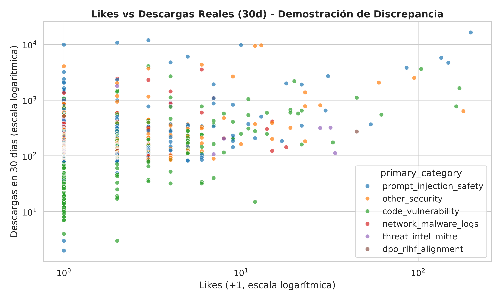
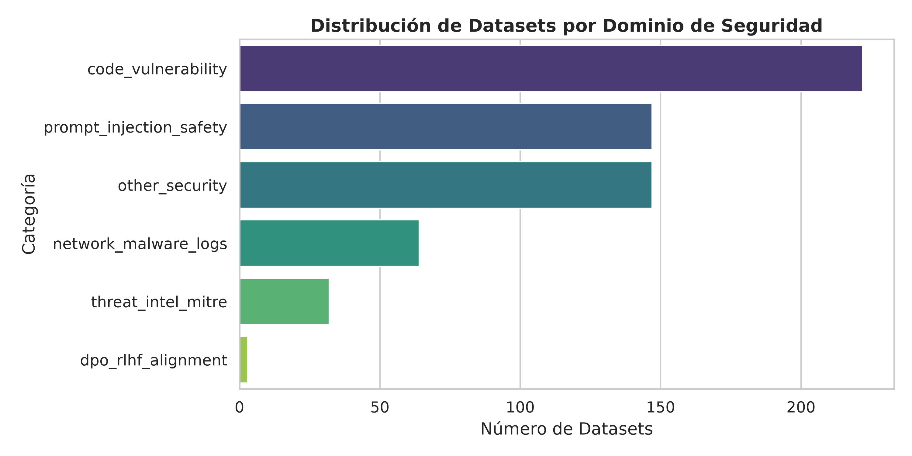
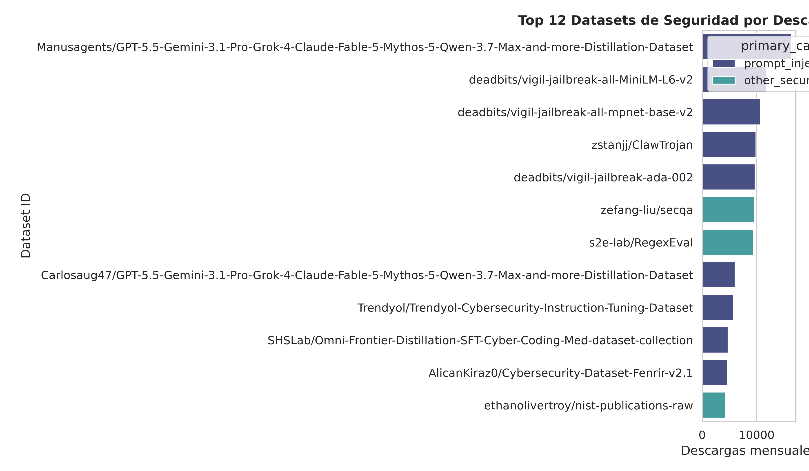

# Hugging Face Security Datasets Study

Estudio cuantitativo y cualitativo de tendencias, adopción y esquemas en los conjuntos de datos de seguridad alojados en Hugging Face.

## Estructura del Proyecto

```text
hf-security-study/
├── data/
│   ├── raw/                 # Metadatos extraídos crudos (.json / .csv)
│   ├── samples/             # Muestras ligeras de filas de datasets clave
│   └── processed/           # Tablas limpias y procesadas listas para análisis
├── notebooks/
│   ├── 01_extraccion_metadatos.ipynb   # Exploración y testing de HfApi
│   ├── 02_eda_tendencias.ipynb        # Análisis de adopción (descargas vs likes, tiempo)
│   └── 03_inspeccion_esquemas.ipynb   # Evaluación de columnas, MITRE, formatos
├── src/
│   ├── __init__.py
│   ├── extractor.py         # Extracción modular de metadatos vía HfApi
│   ├── inspector.py         # Muestreo ligero de esquemas sin clonar repos
│   └── parser.py            # Categorización por casos de uso
├── reports/
│   └── figures/             # Gráficos y visualizaciones generadas
├── requirements.txt         # Dependencias Python
├── .env.example             # Configuración opcional para HF_TOKEN
└── README.md
```

## Primeros Pasos

### 1. Preparar el entorno virtual
```bash
python3 -m venv .venv
source .venv/bin/activate
pip install -r requirements.txt
```

### 2. Extraer metadatos de Hugging Face
```bash
python3 -m src.extractor
```
Esto generará los archivos `data/raw/security_datasets_metadata.csv` y `data/raw/security_datasets_metadata.json`.

### 3. Clasificar y generar gráficos
```bash
python3 -m src.parser
python3 -m src.visualizer
```

---

## Hallazgos Clave y Tendencias

### 1. Likes vs Adopción Real (Descargas)
Los datos demuestran que los **likes no representan el uso real en producción**. Datasets con 0 o 2 likes superan las 10,000 descargas mensuales en pipelines de entrenamiento y evaluación:



### 2. Dominios Más Utilizados
El ecosistema está dominado ampliamente por dos categorías: **Detección de Vulnerabilidades en Código** y **Safety / Prompt Injection**:



### 3. Top Datasets Más Descargados



